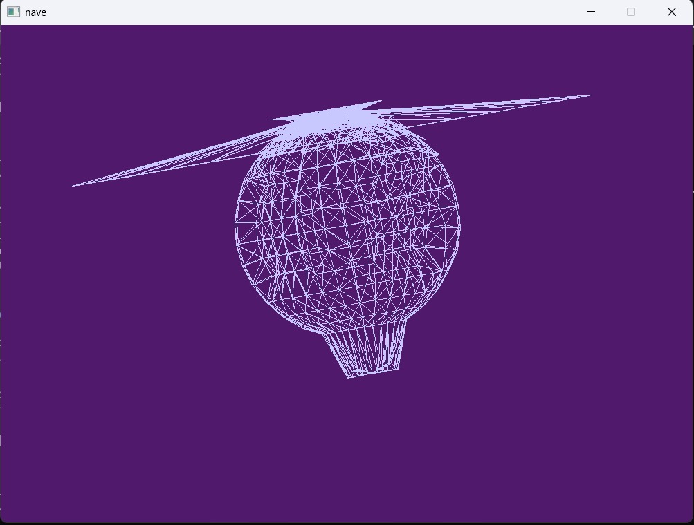

# Proyecto de nave :D

Wireframe de nave hecha en blender. Tenía otra más bonita pero tenía 18millones de líneas el .obj 😔. 

## Para correr `cargo run` dentro de esta carpeta, luego de clonar. 

### Requisitos: Rust

### Muestra que funciona :D

